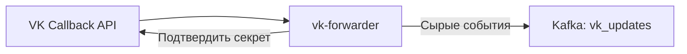
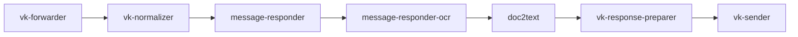

## О приложении

vk-forwarder поднимает HTTP‑сервер для Callback API ВКонтакте, валидирует секрет/confirmation и пересылает все события в Kafka. Тело запроса не изменяется — downstream‑сервисы разбирают его сами.

## Роль приложения в архитектуре проекта

Это вход во VK‑ветку:


Forwarder изолирует публичный webhook и гарантирует доставку событий в Kafka, а health‑эндпоинт позволяет мониторить состояние.

## Локальный запуск

1. Потребуется Go ≥ 1.24 и доступ к Kafka‑кластеру. Необходимо настроить Callback API в группе VK и направить запросы на публичный адрес forwarder.
2. Экспортируйте переменные:
   - `SERVER_ADDR_VK_FORWARDER` — адрес HTTP‑сервера (например, `:8080`).
   - `KAFKA_BOOTSTRAP_SERVERS_VALUE`, `KAFKA_TOPIC_NAME_VK_UPDATES`, `KAFKA_SASL_USERNAME`, `KAFKA_SASL_PASSWORD`.
   - `VK_CONFIRMATION` — строка подтверждения, которую нужно вернуть VK при первом вызове.
   - `VK_SECRET` — секрет, которым VK подписывает события.
3. Запустите приложение:
   ```bash
   go run ./cmd/vkforwarder
   ```
   или через Docker.
4. Настройте URL вебхука (`https://<домен>/webhook`), дождитесь успешного confirmation от VK и убедитесь, что события появляются в `KAFKA_TOPIC_NAME_VK_UPDATES`. Здоровье проверяется запросом `GET /healthz`.
